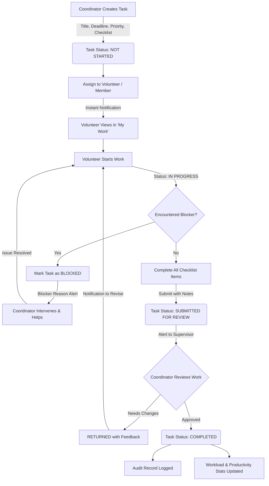
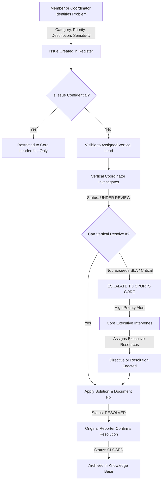
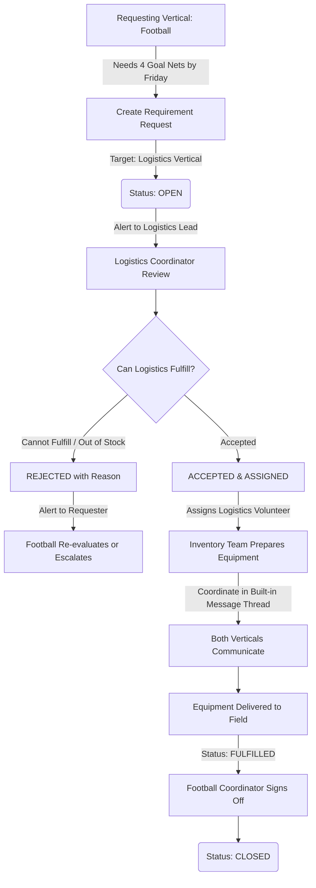
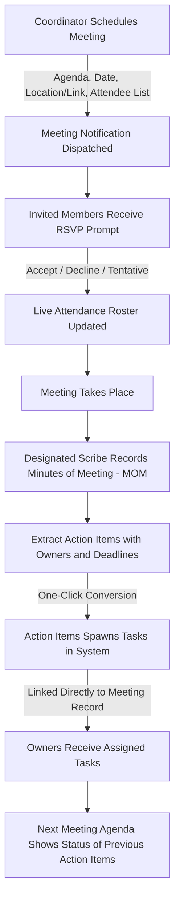
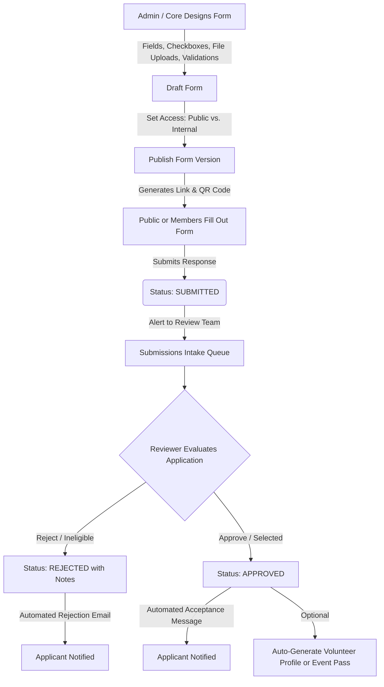

# Paradox Sports OMS — System Workflow & Data Flow Specification

A comprehensive, non-technical operational blueprint describing how work, responsibilities, decisions, and data flow through the Paradox Sports Organization Management System.

This document is structured specifically to help design **Flowcharts**, **Swimlane Diagrams**, **Sequence Maps**, and **Standard Operating Procedures (SOPs)**.

---

## 1. The Human Organization Model: Roles & Verticals

Paradox Sports OMS operates on a matrix structure: **Operational Verticals** (functional departments) intersected by **Organizational Tiers** (levels of authority).

```
                      [System Administrator]
                                │
                    [Sports Core Leadership]
                                │
                      [Deputy Core Team]
                                │
                     [Super Coordinators]
                                │
                   [Vertical Coordinators]
                     (Football, Logistics,
                      Events, Media, Tech)
                                │
                     [Volunteers & Members]
```

### The 7 Key Personas & Their Responsibilities

| Persona / Role | Operational Role | Primary Responsibilities in the System |
| :--- | :--- | :--- |
| **System Admin** | Governance & Platform Owner | Manages user accounts, enforces organization settings, monitors system audit trails, configures platform rules. |
| **Sports Core** | Executive Leadership | Sets organizational priorities, issues binding directives, approves budgets/events, resolves escalated critical issues. |
| **Deputy Core** | Operational Executive | Oversees multi-vertical initiatives, reviews weekly operational roll-ups, resolves cross-vertical conflicts. |
| **Super Coordinator** | Cluster Lead | Oversees a group of related verticals (e.g., all field sports, or media + tech), manages shared resources. |
| **Coordinator** | Vertical Department Commander | Assigns daily tasks, reviews daily work reports, raises resource requirements, conducts meetings, logs issues. |
| **Volunteer / Member** | Frontline Execution | Picks up and updates assigned tasks, submits daily reports, flags blockers, attends meetings, executes field operations. |
| **Event Team Member** | Event-Specific Operator | Manages event rosters, executes readiness checklists on game day, liaises with venue and medical POCs. |
| **Public / External Respondent** | Non-authenticated User | Fills out public registration forms, sports trial applications, or feedback surveys. |

---

## 2. Master Workflows & Data Routing

---

### Workflow 1: Task Management & Work Delegation

This is the primary engine of daily operations. Tasks represent concrete deliverables that must be executed by individuals or teams.

#### Step-by-Step Data Journey



#### Detailed Breakdown

1. **Initiation (Coordinator / Core)**:
   - Coordinator creates a task with: Title, Description, Target Vertical, Deadline, Priority (Low/Medium/High/Critical), Estimated Hours, and Checklist Steps.
   - Initial State: `NOT_STARTED`.

2. **Assignment & Notification**:
   - Coordinator assigns the task to a specific Volunteer or multiple Members.
   - **Data Flow**: The task immediately appears in the Assignee’s personal "My Work" dashboard and central calendar. An attention notification is sent to the assignee.

3. **Execution (Volunteer)**:
   - Volunteer marks the task as `IN_PROGRESS`.
   - As work progresses, the Volunteer checks off checklist items and updates the completion percentage.

4. **Handling Roadblocks (Blocker Flow)**:
   - If an obstacle occurs (e.g., missing equipment, permission denied), the Volunteer changes status to `BLOCKED` and provides a mandatory **Blocker Explanation**.
   - **Data Flow**: The task health badge turns red across all vertical dashboards. An alert is instantly routed to the Coordinator's desk to take corrective action.
   - Once the Coordinator resolves the roadblock, the task returns to `IN_PROGRESS`.

5. **Submission for Review**:
   - Once 100% of checklist steps are done, the Volunteer submits the task for review (`SUBMITTED_FOR_REVIEW`) along with completion remarks.
   - **Data Flow**: The task is removed from the active "In Progress" list and enters the Coordinator's "Review Queue".

6. **Supervisor Decision**:
   - **If Approved**: Status changes to `COMPLETED`. The volunteer’s score/history updates, the deadline is cleared from the pending calendar, and an immutable log entry is sealed.
   - **If Incomplete**: Coordinator flags it as `RETURNED` with constructive review notes. The task drops back into the Volunteer's active queue with an amber "Needs Revision" badge.

---

### Workflow 2: Issue Raising, Vertical Triage & Executive Escalation

Issues represent unexpected problems, safety concerns, disciplinary disputes, technical failures, or logistical shortages that disrupt operations.

#### Step-by-Step Data Journey



#### Detailed Breakdown

1. **Raising the Issue (Any Member / Coordinator)**:
   - Anyone in the organization can log an issue.
   - Attributes provided: Problem Title, Detailed Description, Category (Facilities, Safety, Logistics, Personnel, Tech), Priority (Low, Medium, High, Critical), and **Sensitivity Level** (`NORMAL` vs. `CONFIDENTIAL`).

2. **Data Routing & Security Triage**:
   - **Normal Issues**: Routed directly to the target Vertical Coordinator's Issue Inbox.
   - **Confidential Issues**: Bypasses normal channels and is visible *strictly* to `SPORTS_CORE` and `ADMIN` (e.g., harassment reports, sensitive financial discrepancies).

3. **Investigation & Action**:
   - Coordinator acknowledges receipt -> Moves status to `UNDER_REVIEW` or `IN_PROGRESS`.
   - The coordinator can post continuous progress updates in an activity log.

4. **Escalation Path**:
   - If the issue cannot be resolved at the vertical level (e.g., venue contract breach, inter-vertical dispute, safety hazard), or if it stays open past its SLA deadline, it is **Escalated**.
   - **Data Flow**: The issue priority is automatically boosted to `CRITICAL`. An urgent alert flashes on the Sports Core Executive Dashboard.

5. **Resolution & Sign-off**:
   - The resolving authority documents the root cause and the fix, setting the state to `RESOLVED`.
   - The original reporter is notified to verify the outcome. Once satisfied, the issue moves to `CLOSED`.

---

### Workflow 3: Daily Work Reports & Accountability Cadence

Daily reports ensure transparent operational tracking without requiring micromanagement meetings. Every working team member submits a daily digest.

#### Step-by-Step Data Journey

```mermaid
graph TD
    A[Volunteer / Member Finishes Shift] --> B[Open Daily Report Entry]
    B -->|Logs Hours, Tasks Done, Blockers, Tomorrow's Plan| C[Report Drafted]
    C -->|Clicks Submit| D(Report Status: SUBMITTED)
    D -->|Instant Feed Alert| E[Coordinator Review Inbox]
    
    E --> F{Coordinator Reviews Report}
    Note right of F: System prevents self-review
    
    F -- Incomplete / Needs Details --> G[Action: RETURNED / FLAGGED]
    G -->|Feedback Sent| H[Volunteer Edits and Resubmits]
    H --> D
    
    F -- Satisfactory & Verified --> I[Action: APPROVED / REVIEWED]
    I --> J[Member Productivity Recorded]
    I --> K[Rolls Up Into Vertical Weekly Analytics]
```

#### Detailed Breakdown

1. **Drafting (Member / Volunteer)**:
   - At the end of each operational day, the member logs their work:
     - Work Summary
     - Specific Tasks worked on
     - Total Hours logged
     - Blockers or difficulties encountered
     - Plan for tomorrow / next shift

2. **Submission**:
   - Member submits the report (`SUBMITTED`).
   - The report becomes read-only for the member until reviewed.

3. **Review Guardrail (Self-Review Prohibition)**:
   - **Strict Rule**: A user can never approve their own report. Even if a Coordinator writes a daily report for their own work, it must be reviewed by their Super Coordinator or Deputy Core.

4. **Supervisor Evaluation**:
   - **Approved (`REVIEWED`)**: Coordinator signs off, leaves optional praise or remarks. The report is locked.
   - **Returned (`RETURNED`)**: If the report lacks required information, the supervisor sends it back with comments. The member receives an alert, updates the missing fields, and resubmits.

5. **Aggregation**:
   - All approved daily reports automatically feed the Vertical's daily attendance stats and weekly roll-up analytics.

---

### Workflow 4: Cross-Vertical Resource Requirements & Procurement

When one vertical needs equipment, budget, personnel, or services from another vertical (e.g., Football needs 4 Goal Nets from Logistics).

#### Step-by-Step Data Journey



#### Detailed Breakdown

1. **Raising the Requirement**:
   - The requesting vertical specifies: What is needed, Quantity, Date/Time needed by, and Target Vertical.
   - Initial State: `OPEN`.

2. **Triage by Target Vertical**:
   - The Target Vertical Coordinator receives the requirement in their incoming queue.
   - The coordinator inspects inventory and resource availability.

3. **Decision & Assignment**:
   - **Reject**: Coordinator provides reasons (e.g., out of stock, date conflict). The requester is notified immediately.
   - **Accept**: Status becomes `ASSIGNED`. The coordinator designates an internal volunteer to fulfill the request.

4. **Two-Way Threaded Communication**:
   - Both verticals communicate within the requirement’s dedicated message thread (e.g., "The nets are packed at Bay 2; pickup time 3 PM").

5. **Delivery & Sign-off**:
   - Target vertical delivers goods/service -> marks as `FULFILLED`.
   - Requesting vertical inspects and confirms receipt -> marks as `CLOSED`.

---

### Workflow 5: Event Management, POC Rostering & Readiness Checklists

Governs major tournaments, matches, training camps, and sports ceremonies.

#### Step-by-Step Data Journey

```mermaid
graph TD
    A[Core / Event Lead Creates Event] -->|Dates, Venue, Sport, Capacity| B(Event Status: DRAFT)
    B --> C[Configure Event Structure]
    C --> D[Assign Point-of-Contacts - POCs]
    Note right of D: Medical, Technical, Logistics, Security POCs
    C --> E[Build Readiness Checklist]
    Note right of E: Pitch, First Aid, Sound, Trophies
    
    D & E --> F[Publish Event Schedule]
    F -->|Status: PLANNED| G[Verticals Mobilize Teams]
    
    G --> H[Game Day / Event Eve]
    H --> I[POCs Complete Checklist Items with Evidence]
    I --> J{Are All Safety & Readiness Items 100% Checked?}
    
    J -- Incomplete Checklist --> K[Warning Alert to Core Leadership]
    K --> L[Intervene to Fix Missing Items]
    L --> I
    
    J -- All Items Verified --> M[Executive Signs Off: READY]
    M -->|Status: ACTIVE / LIVE| N[Live Event Conducted]
    N -->|Status: CONCLUDED| O[Post-Event Debrief & Archival]
```

#### Detailed Breakdown

1. **Creation & Configuration (`DRAFT`)**:
   - Event organizers define Event Name, Sports Category, Venue, Start/End Times, and Participant Quotas.

2. **Rostering & POC Designation**:
   - Special Point of Contacts (POCs) are assigned from different verticals:
     - Medical POC (First-aid stations, ambulance)
     - Security POC (Crowd management, gate access)
     - Technical POC (Live scoreboards, stream)
     - Equipment POC (Balls, bibs, whistles)

3. **Readiness Verification (`PLANNED` -> `READY`)**:
   - Before an event goes live, every designated POC must sign off on their respective **Readiness Checklist**.
   - Each checklist item requires a timestamp, responsible person, and status (e.g., "Ambulance on standby: Confirmed").

4. **Live Execution & Conclusion**:
   - When all readiness requirements hit 100%, Core marks the event as `ACTIVE`.
   - Once the final whistle blows and presentations finish, the event transitions to `CONCLUDED`.

---

### Workflow 6: Operational Meetings & Action Item Accountability

Eliminates "meetings that could have been emails" by binding agendas, attendance, minutes, and direct task creation into one chain.

#### Step-by-Step Data Journey



#### Detailed Breakdown

1. **Scheduling**: Coordinator creates meeting with Agenda, Time, Venue/Link, and Invited Members.
2. **RSVP**: Attendees confirm attendance. Coordinators can see real-time attendance quorum.
3. **Minutes of Meeting (MOM)**: Notes, decisions, and agreements are posted directly in the meeting record.
4. **Action Item to Task Bridge**: Each action item is assigned an owner and deadline. The system allows converting an action item directly into a tracked Task with a single click.

---

### Workflow 7: Dynamic Forms, Public Submissions & Evaluation

Used for athlete registrations, volunteer applications, equipment audits, and public sports trials.

#### Step-by-Step Data Journey



#### Detailed Breakdown

1. **Form Creation**: Form designer builds questions (text, dropdowns, document uploads, signatures).
2. **Access Control**:
   - `PUBLIC`: Accessible by anyone on the internet via clean link.
   - `INTERNAL`: Requires active OMS login (used for internal audits, gear requests).
3. **Review Process**: Submissions land in an organized queue where reviewers score or approve applicants.
4. **Outcome**: Approved submissions can automatically feed into event rosters or user registrations.

---

### Workflow 8: Operational Directives & Broadcast Announcements

Used by executive leadership to communicate policy changes, safety mandates, or urgent cancellations.

#### Step-by-Step Data Journey

```mermaid
graph TD
    A[Sports Core Leadership Drafts Directive] -->|Urgent Policy, Mandatory Rule, Target Scope| B[Draft Directive]
    B -->|Scope: All Org OR Specific Verticals| C[Issue Directive]
    
    C -->|High-Priority Banner| D[Appears in Recipient Attention Feeds]
    C -->|Generates Compliance Roster| E[Every Member Gets a 'Pending Acknowledgment' Entry]
    
    D --> F[Member Opens Directive and Reads Terms]
    F -->|Clicks 'I Acknowledge & Understand'| G[Acknowledgment Timestamped]
    
    G --> H[Live Compliance Tracker Updates]
    H --> I{Leadership Monitors Compliance Dashboard}
    Note right of I: Shows % of members who have acknowledged
    
    I -- Outstanding Members --> J[Automated Reminder Sent]
```

#### Detailed Breakdown

1. **Drafting & Scope**: Sports Core defines the directive content and scope (All Organization vs. Selected Verticals).
2. **Compliance Roster**: Upon issuance, the system generates an immutable checklist tracking every single recipient.
3. **Mandatory Acknowledgment**: Members are greeted with a high-priority banner until they open the directive and click "Acknowledge".
4. **Live Audit Dashboard**: Leadership can see in real time: "Logistics: 94% acknowledged, Football: 100% acknowledged, Media: 60% acknowledged" and nudge outstanding members.

---

## 3. Cross-Workflow Connections (How Modules Link)

The true power of Paradox Sports OMS is how individual workflows connect to form an automated chain of accountability:

```
[Meeting Held]
     │
     └──► Action Item Created
               │
               └──► Automatically spawns a [Task]
                         │
                         ├──► Assigned to Volunteer
                         │
                         └──► Volunteer encounters a roadblock
                                   │
                                   └──► Flags Blocker & logs an [Issue]
                                             │
                                             └──► Needs gear from Logistics
                                                       │
                                                       └──► Raises [Requirement]
```

| Source Trigger | Target Action | Resulting Data Flow |
| :--- | :--- | :--- |
| **Meeting Action Item** | Convert to Task | Auto-populates Task Title, Assignee, and Deadline linked back to the meeting notes. |
| **Daily Report Blocker** | Convert to Issue | Automatically creates an Issue ticket in the vertical register so it doesn't get lost. |
| **Task Failure / Blocker** | Alert Coordinator | Flags the task red, alerts supervisor, and prevents dependent tasks from starting. |
| **Event Planning** | Cross-Vertical Requirement | Event lead requests sound equipment from Logistics and security guards from Security. |
| **Public Form Approval** | User / Roster Intake | Approved athlete registration automatically adds them to the tournament participant roster. |

---

## 4. User-by-User Interaction & Action Matrix

A quick-reference guide answering: *"If I am Persona X, what buttons do I press, what data do I send, and what happens next?"*

### 1. Volunteer / Frontline Member
- **When starting shift**: Check **My Work** dashboard -> Click task -> Click **Start Work** (`IN_PROGRESS`).
- **When hitting a roadblock**: Click **Mark as Blocked** -> Enter reason -> Coordinator receives instant red alert.
- **When completing work**: Complete checklist -> Enter completion notes -> Click **Submit for Review** -> Goes to Coordinator.
- **At end of shift**: Go to **Daily Reports** -> Fill hours, summary, blockers -> Click **Submit** -> Coordinator reviews.
- **When an announcement/directive is posted**: Review banner -> Click **Acknowledge** -> Removes alert, marks compliant.

### 2. Vertical Coordinator
- **When planning operations**: Click **New Task** -> Set title, checklist, priority, deadline -> Assign to team member -> Assignee gets notification.
- **When monitoring shift**: Check **Team Workload** and **Blockers list** -> Help unblock members -> Move task back to progress.
- **When reviewing daily reports**: Go to **Reports Queue** -> Inspect summary -> Click **Approve** or **Return with Feedback**.
- **When resources are needed**: Go to **Requirements** -> Click **New Requirement** -> Select target vertical -> Target coordinator triages.
- **When a problem occurs**: Go to **Issues** -> Log problem -> If serious, click **Escalate to Core**.

### 3. Sports Core & Executive Leadership
- **When setting policy**: Go to **Directives** -> Write mandate -> Select target verticals -> Issue -> Monitor compliance dashboard.
- **When high-stakes issues arise**: Inspect **Escalations Inbox** -> Allocate emergency funds, approve venue swaps, or resolve disputes.
- **When reviewing operational health**: Check **Weekly Roll-Up Reports** -> Inspect attendance, task completion rates, and active issues across all verticals.
- **When signing off on events**: Inspect **Event Readiness Checklist** -> Confirm 100% POC sign-off -> Authorize event to go live.

---

## 5. Summary State Transition Cheatsheet

For easy reference when building state machine flowcharts:

| Entity | Allowed States | Normal Progression |
| :--- | :--- | :--- |
| **Task** | `NOT_STARTED` -> `IN_PROGRESS` -> `BLOCKED` (optional) -> `SUBMITTED_FOR_REVIEW` -> `COMPLETED` (or `RETURNED`) | Linear with review loop |
| **Issue** | `OPEN` -> `UNDER_REVIEW` -> `IN_PROGRESS` -> `ESCALATED` (optional) -> `RESOLVED` -> `CLOSED` | Escalation branch possible |
| **Daily Report** | `DRAFT` -> `SUBMITTED` -> `REVIEWED` (or `FLAGGED` / `RETURNED`) | Review loop with supervisor |
| **Requirement** | `OPEN` -> `ASSIGNED` (or `REJECTED`) -> `IN_PROGRESS` -> `FULFILLED` -> `CLOSED` | Cross-vertical delivery |
| **Event** | `DRAFT` -> `PLANNED` -> `READY` -> `ACTIVE` -> `CONCLUDED` (or `CANCELLED`) | Milestone / gatekeeper progression |
| **Form Submission** | `SUBMITTED` -> `UNDER_REVIEW` -> `APPROVED` or `REJECTED` | Intake gate |
| **Directive** | `DRAFT` -> `ISSUED` -> `ACKNOWLEDGED` (per member) -> `ARCHIVED` | Compliance roster tracking |

---

*This document serves as the authoritative functional reference for Paradox Sports OMS operational diagrams, UI workflows, and training materials.*
