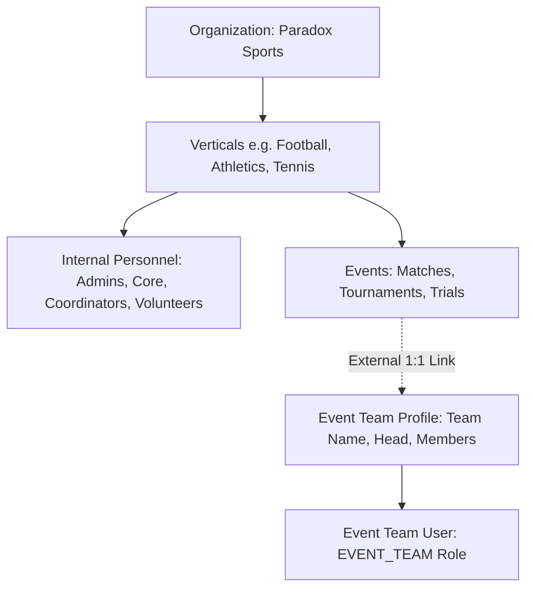
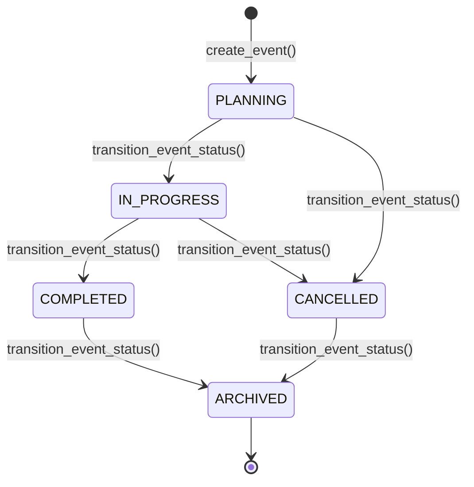

# Phase 3 Architecture: Event + Event Team Operations

## Paradox Sports OMS — Authoritative Product Specification Implementation

---

## 1. Overview & Organizational Boundary

Phase 3 establishes the operational system for **Events** and **Event Teams** within the Paradox Sports Operations Management System (OMS), strictly upholding the fundamental separation between **Internal Sports Operations** and **Event Team Operations**:

### Key Architectural Tenets:
1. **Zero Department Rule**: The internal hierarchy remains strictly `Organization -> Vertical -> User`. No "Department" entity exists.
2. **External Participant Isolation**: An **Event Team** is an external operational entity linked 1:1 with an `EVENT_TEAM` User account and associated explicitly with an `Event`. It is **NOT** part of the internal organizational hierarchy.
3. **No Spillover Authorization**: Association with an Event does not grant unrestricted access. All resources are partitioned into **Internal** and **Event-Facing** data.
4. **POC Group Architecture**: An Event is coordinated by exactly 1 active Head POC (`primary_poc_id`) and designated POC members in `event_members`, validated at runtime to belong to the target Vertical.

---

## 2. Event Model & State Machine Lifecycle

Events follow a strict server-authoritative state machine:

### Transition Validation Rules:
- Direct transitions skipping active states (e.g. `PLANNING` &rarr; `COMPLETED`) are rejected with `HTTP 422 / 400`.
- Once `ARCHIVED`, an event is permanently sealed; any attempt to transition backwards is strictly rejected.
- Default Readiness: On creation, 8 standardized readiness checkpoints are automatically populated:
  - `PLANNING`
  - `COORDINATION`
  - `DOCUMENTATION`
  - `COMMUNICATIONS`
  - `TECHNICAL_PREPARATION`
  - `MOCK_TRIAL`
  - `FINAL_APPROVAL`
  - `EXECUTION_READINESS`

---

## 3. Information Boundary & Access Control Matrix

| Capability / Resource | Internal Admin / Sports Core | Internal Coordinator / Volunteer | Assigned Head POC & POCs | Event Team Account |
| :--- | :--- | :--- | :--- | :--- |
| **Create Event** | Allowed (`events.create`) | Denied | Denied | **FORBIDDEN (403)** |
| **Transition Lifecycle** | Allowed (`events.transition`) | Denied | Denied | **FORBIDDEN (403)** |
| **Assign POC Group** | Allowed (`events.poc.manage`) | Denied | Denied | **FORBIDDEN (403)** |
| **View Event Details** | All Events | Scoped Events | Assigned Event | **Only Associated Event** |
| **View Event Dashboard** | Complete (Internal + Sensitive) | Scoped (Internal + Sensitive) | Complete (Assigned Event) | **Event-Facing Only (Sensitive issues stripped)** |
| **Readiness Checklist** | Read / Manage All | Read / Manage Vertical | Read / Manage Assigned | **Read Assigned Event Checkpoints** |
| **Update Team Profile** | Allowed (`admin` / `core`) | Denied | Denied | **Self-Profile Only (`/api/v1/event-teams/me`)** |
| **Access Other Event Teams** | Allowed | Scoped | Denied | **FORBIDDEN (403 IDOR rejection)** |
| **Internal Audit Logs** | Allowed (`audit.read`) | Denied | Denied | **FORBIDDEN (403)** |
| **Internal User Directory** | Allowed (`users.manage`) | Denied | Denied | **FORBIDDEN (403)** |

---

## 4. POC Attention Notifications

When an Event Team updates operational details (such as Head name, contact phone, or roster summary) via `/api/v1/event-teams/me`, the system automatically generates `Notification` attention records targeted to:
1. The active **Head POC** (`Event.primary_poc_id`).
2. All active **POC Members** (`EventMemberRole.POC`).

---

## 5. Verification & Persistence Truth

1. **Automated Unit & Security Tests**: `tests/test_phase3_event_operations.py` (9/9 passed).
2. **Full Regression Suite**: 147/147 tests passed (100%).
3. **Standalone PostgreSQL Verification**: `scripts/verify_phase3_event_operations.py` executed against fresh PostgreSQL sessions verifying end-to-end data integrity.
