# Phase 4 — Requests + Meetings + Forms + Workflow Automation Architecture

## 1. Executive Summary

Phase 4 bridges operational silos across Paradox Sports OMS by converting discrete feature capabilities into cohesive, server-authoritative workflows. It implements transactional state machines, four-eyes supervisory controls, audience scoping, idempotent task conversions, automatic attention notifications, and structured entity transformations.

The entire workflow engine adheres strictly to the following foundational principles:
- **Server-Authoritative Validation**: All status transitions, audience permissions, and business rules are verified inside database transactions.
- **Strict Role & Scope Governance**: Strict four-eyes self-approval prohibition prevents authors from approving their own meeting requests or form submissions.
- **Zero Department Concept**: All operational grouping utilizes Organization &rarr; Vertical &rarr; User hierarchy or Event &rarr; Event Team boundaries.
- **Event Team Isolation**: Distinct separation between Internal Meetings and Event Team syncs. Event Team meeting requests automatically route to the Event's Head POC.
- **PostgreSQL Fresh-Session Truth**: Verified against distinct database sessions to guarantee permanent disk persistence.

---

## 2. Core Operational Workflows

```mermaid
flowchart TD
    subgraph Requirements Workflow
        R1[Create Cross-Vertical Requirement] --> R2[Assign Target Vertical User]
        R2 --> R3[Post Messages & Update Status]
        R3 -->|Blocker / Delay| R4[Escalate to Supervisor]
        R4 --> R5[Resolve Escalation Notes]
        R5 --> R6[Complete Requirement]
    end

    subgraph Meeting Lifecycle & Task Automation
        M1[Submit Meeting Request] --> M2{Four-Eyes Review}
        M2 -->|Reject| M3[Rejected Status]
        M2 -->|Approve| M4[Scheduled Status + RSVP Invites]
        M4 --> M5[Meeting Execution & Action Items]
        M5 --> M6[Idempotent Master Task Conversion]
    end

    subgraph Advanced Forms & Entity Transformation
        F1[Define Schema & Target Audience] --> F2[Publish Immutable Version]
        F2 --> F3[Submit Structured Payload]
        F3 --> F4{Supervisor Review}
        F4 -->|Reject| F5[Rejected]
        F4 -->|Approve + Transform| F6[Atomic Entity Generation: Task / Requirement / Event]
    end
```

---

## 3. Schema & Database Enhancements

### 3.1 Migration `c3d4e5f6a1b2_phase4_workflow_automation_requests_meetings_forms`

1. **Requirements Escalation Schema**:
   - `is_escalated: bool` (default `False`, indexed)
   - `escalated_to_id: UUID` (FK `users.id`, nullable)
   - `escalated_by_id: UUID` (FK `users.id`, nullable)
   - `escalated_at: DateTime(timezone=True)` (nullable)
   - `escalation_reason: Text` (nullable)
   - `escalation_status: String(50)` (nullable: `"PENDING_REVIEW"`, `"RESOLVED"`)
   - `escalation_resolved_at: DateTime(timezone=True)` (nullable)
   - `escalation_resolved_by_id: UUID` (FK `users.id`, nullable)
   - `escalation_resolution_notes: Text` (nullable)

2. **Meetings Request & Type Extensions**:
   - `is_requested: bool` (default `False`, indexed)
   - `requested_by_id: UUID` (FK `users.id`, nullable)
   - `meeting_type_enum` added value: `EVENT_TEAM_SYNC`
   - `meeting_status_enum` added values: `REQUESTED`, `REJECTED`

3. **Forms Scope & Audience Extensions**:
   - `event_id: UUID` (FK `events.id`, nullable, indexed)
   - `form_audience_enum` added values: `EVENT`, `EVENT_TEAM`

---

## 4. Subsystem Details

### 4.1 Cross-Vertical Requirements & Escalations
- **Routing & Validation**: Requester selects source and target verticals. Assignee must be actively assigned to the target vertical division.
- **Escalation Chain**: Coordinators can escalate blocked requirements to Supervisors or Core leadership. Generates an immediate priority notification.
- **Resolution**: Escalation reviewer submits formal resolution notes, clears `is_escalated`, updates `escalation_status="RESOLVED"`, and notifies all parties.

### 4.2 Meeting Management & Action Item Conversion
- **Internal vs. Event Team Meetings**: Internal meetings are restricted to staff roles. Event Team meeting requests automatically route to the Event's Head POC as organizer with `EVENT_TEAM_SYNC` classification.
- **Four-Eyes Review**: Requesters are forbidden from approving their own meeting requests (`ForbiddenException`).
- **Idempotent Master Task Conversion**: Meeting action items can be transformed into Master Tasks (`TaskType.MEETING_FOLLOW_UP`). Subsequent conversion attempts are strictly prevented with validation errors.

### 4.3 Advanced Forms & Entity Transformation
- **Audience Isolation**: Event Teams only see forms designated for `ALL`, `EVENT_TEAM`, or their specific `EVENT`. Internal forms are protected against submission by event teams.
- **Immutable Versioning**: Schema modifications create draft versions. Published versions cannot be altered.
- **Atomic Transformation**: Approved submissions can atomically instantiate:
  - **Master Tasks** (`TaskType.ROUTINE`, assigned within the form's vertical context)
  - **Cross-Vertical Requirements** (`RequirementStatus.OPEN`)
  - **Events** (`EventStatus.PLANNING`, with configured planned dates and pocs)

### 4.4 Automated Notifications & Audit Trails
- Dispatches notifications on:
  - Requirement creation, assignment, message updates, and escalations.
  - Meeting invitations, approval/rejection, rescheduling, and cancellations.
  - Form submission receipt and approval/rejection decisions.
- Every state transition produces an audit trail entry (`AuditEvent`) with actor, action, timestamp, and metadata.

---

## 5. Verification & Test Coverage

| Test Suite Module | Status | Total Tests |
| :--- | :--- | :--- |
| `tests/test_phase4_requests_meetings_forms_automation.py` | **PASSED** | 10 / 10 |
| `tests/test_operational_workflows_acceptance.py` | **PASSED** | 8 / 8 |
| `tests/test_phase4_security.py` | **PASSED** | 14 / 14 |
| **Complete Test Suite (All 28 Modules)** | **PASSED** | **157 / 157** |
| `scripts/verify_phase4_workflow_automation.py` | **PASSED** | Full Fresh DB Sessions Verified |

---

## 6. Hard Stop Discipline

Phase 4 implementation is **100% complete and verified**. No modifications are permitted without explicit scope elevation. Phase 5 work remains strictly out of scope.
